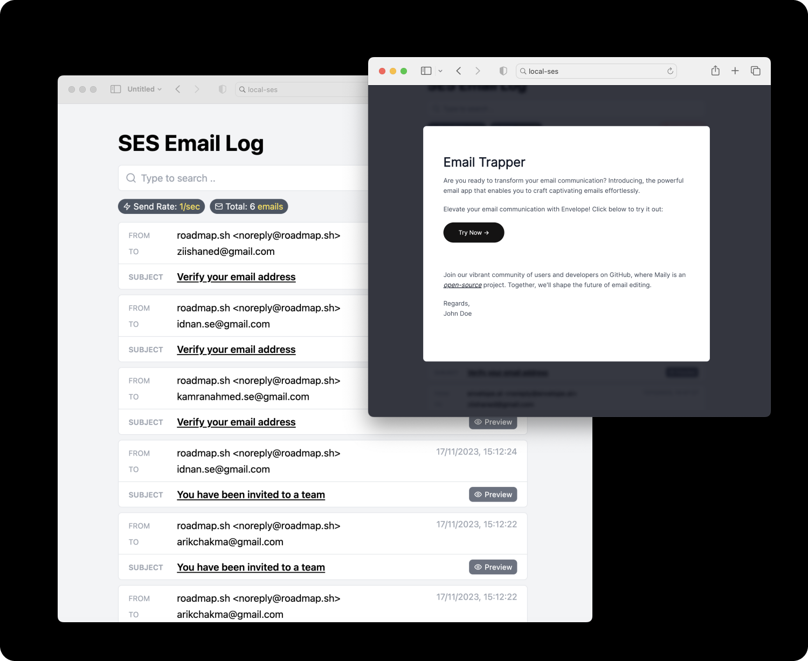

# local-ses

> Trap and test AWS SES emails locally - Supporting both SES v1 and v2 APIs



## Features

- ✅ **SES v1 Support**: Compatible with legacy AWS SES v1 API (form-encoded requests)
- ✅ **SES v2 Support**: Full support for AWS SES v2 API (JSON requests)
- ✅ **Email Testing**: Simulate delivery, bounces, complaints, and clicks
- ✅ **Real-time UI**: View trapped emails in a modern web interface
- ✅ **Docker Ready**: Easy deployment with Docker

## Setup

You can simply use `docker` to run the service locally

```bash
docker run -d --name local-ses -p 8282:8282 dansyuqri/local-ses:latest
```

This will start the service on port `8282`. Next, modify your SES client to use the local service.

## Development

### Using Make Commands

The project includes a `Makefile` with convenient commands for development and deployment:

```bash
# Build Docker image for multiple platforms and push to registry
make build

# Run the Docker container locally
make run

# Run tests
make test
```

### Local Development

For local development without Docker:

```bash
# Install dependencies
pnpm install

# Start development server on port 8282
pnpm run dev

# Build for production
pnpm run build

# Run production build
pnpm run prod

# Run tests
pnpm run test
```

### SES v2 (Recommended)

For the newer AWS SES v2 API using `@aws-sdk/client-sesv2`:

```javascript
import { SESv2Client, SendEmailCommand } from "@aws-sdk/client-sesv2";

const client = new SESv2Client({
  region: "us-east-1",
  credentials: {
    accessKeyId: "test",
    secretAccessKey: "test",
  },
  endpoint: "http://localhost:8282", // <--- Add this to trap emails locally
});

// Send emails as usual
const command = new SendEmailCommand({
  FromEmailAddress: "sender@example.com",
  Destination: {
    ToAddresses: ["recipient@example.com"],
  },
  Content: {
    Simple: {
      Subject: {
        Data: "Test Subject",
        Charset: "UTF-8"
      },
      Body: {
        Text: {
          Data: "This is the text body",
          Charset: "UTF-8"
        },
        Html: {
          Data: "<h1>This is the HTML body</h1>",
          Charset: "UTF-8"
        }
      }
    }
  }
});

const result = await client.send(command);
console.log(`Email sent with message ID: ${result.MessageId}`);
```

### SES v1

For AWS SES v1 API using `@aws-sdk/client-ses`:

```javascript
import { SESClient, SendEmailCommand } from "@aws-sdk/client-ses";

const client = new SESClient({
  region: "us-east-1",
  credentials: {
    accessKeyId: "test",
    secretAccessKey: "test",
  },
  endpoint: "http://localhost:8282", // <--- Add this to trap emails locally
});

// Send emails as usual
const command = new SendEmailCommand({
  Source: "sender@example.com",
  Destination: {
    ToAddresses: ["recipient@example.com"],
  },
  Message: {
    Subject: {
      Data: "Test Subject",
    },
    Body: {
      Text: {
        Data: "This is the text body",
      },
      Html: {
        Data: "<h1>This is the HTML body</h1>",
      }
    }
  }
});

const result = await client.send(command);
console.log(`Email sent with message ID: ${result.MessageId}`);
```

## License

MIT © [Syuqri](https://github.com/Dansyuqri)

## Acknowledgments
This repo is a fork from [Kamran Ahmed's local-ses](https://github.com/kamranahmedse/local-ses)
It was forked with the main purpose of adding missing functionality, without the overhead of approvals.

## Contributions
Open to contributions!
